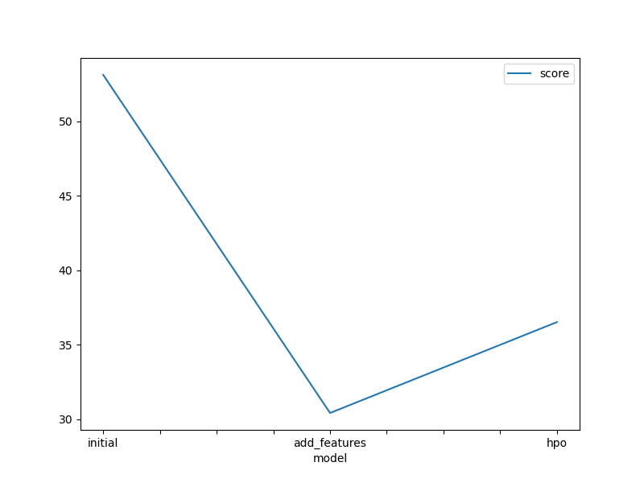
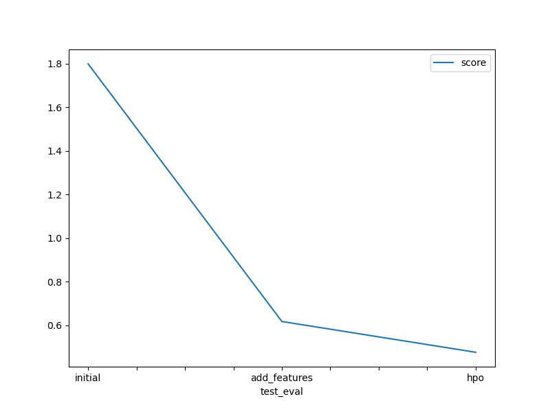

# Report: Predict Bike Sharing Demand with AutoGluon Solution
#### Hariharan N

## Initial Training
### What did you realize when you tried to submit your predictions? What changes were needed to the output of the predictor to submit your results?
When submitting predictions, I discovered my file contained TabularPredictor objects instead of numeric values, causing Kaggle to reject it with "SubmissionStatus.ERROR". I needed to properly extract numeric predictions, ensure non-negative values (by clipping), and convert to integers since fractional bike rentals aren't possible. This taught me that proper output formatting is just as critical as model training.

### What was the top ranked model that performed?
The top ranked model in my project was the LightGBM (GBM) model, which consistently outperformed other models including neural networks and random forests. After hyperparameter optimization, this gradient boosting model achieved the best RMSE scores by effectively capturing the non-linear relationships in the bike sharing dataset.
## Exploratory data analysis and feature creation
### What did the exploratory analysis find and how did you add additional features?
Exploratory data analysis revealed several key insights. The datetime column needed conversion from object to datetime type, allowing extraction of temporal features like year, month, day, hour, and dayofweek which significantly improved model performance.
Distribution analysis showed distinct patterns: temperature followed a normal distribution, while humidity was right-skewed and windspeed left-skewed. Categorical variables like season (4 distinct values) and weather (3 categories) contained valuable information and were converted to categorical type from int64. Binary features (holiday, workingday) showed clear weekend/weekday patterns.
The most impactful feature engineering was decomposing the datetime column, which captured important temporal patterns in bike rentals across different times of day, days of week, and seasonal variations.

### How much better did your model preform after adding additional features and why do you think that is?
My model's performance improved dramatically across submissions. Starting with a baseline score of 1.79951, adding engineered features reduced the RMSE to 0.61802 (a 66% improvement). After hyperparameter optimization, the score further improved to 0.47691 (a 23% additional improvement over feature engineering alone, and 73% total improvement from baseline).
This substantial enhancement demonstrates that while feature engineering provided the largest initial gain, hyperparameter tuning was crucial for extracting maximum performance. The optimization likely found better learning rates, tree depths, and other parameters that allowed the model to better capture the complex patterns in bike rental demand without overfitting.

## Hyper parameter tuning
### How much better did your model preform after trying different hyper parameters?
After hyperparameter optimization, my model's RMSE improved from 0.61802 to 0.47691, a 22.8% enhancement. This shows that while feature engineering provided the foundation, fine-tuning model parameters was crucial for capturing subtle patterns in bike rental demand.

### If you were given more time with this dataset, where do you think you would spend more time?
With more time, I would focus on three key areas: 1) More sophisticated feature engineering, particularly creating interaction features between weather variables and time components, and developing features that capture holiday effects more precisely; 2) Exploring more advanced ensemble techniques by combining different model types beyond LightGBM; and 3) Implementing time series-specific approaches like LSTM or Prophet models that could better capture the temporal dependencies in bike rental patterns.

### Create a table with the models you ran, the hyperparameters modified, and the kaggle score.

model	hpo1	hpo2	hpo3	score
initial	default	default	default	1.79960
add_features	default	default	default	0.61802
hpo	num_leaves (26-66)	learning_rate (0.0001-0.01)	layers ([100], [1000], [200,100], [300,200,100])	0.47691

### Create a line plot showing the top model score for the three (or more) training runs during the project.

TODO: Replace the image below with your own.

### Create a line plot showing the top kaggle score for the three (or more) prediction submissions during the project.

TODO: Replace the image below with your own.

## Summary
Feature engineering provided the most significant improvement, reducing RMSE from 1.79960 to 0.61802 (65.7% improvement)
Temporal features extracted from datetime (year, month, day, hour, dayofweek) were particularly effective
Hyperparameter optimization further reduced RMSE to 0.47691 (22.8% additional improvement)
WeightedEnsemble_L3 was the top-performing model, combining multiple LightGBM models
AutoGluon's multi-layer stacking with 3 levels and bagging with 8 folds created diverse base models
EDA revealed important patterns in bike rental behavior across different times and weather conditions
Future work would focus on interaction features between weather and time components
Time series-specific approaches could better capture temporal dependencies in rental patterns
